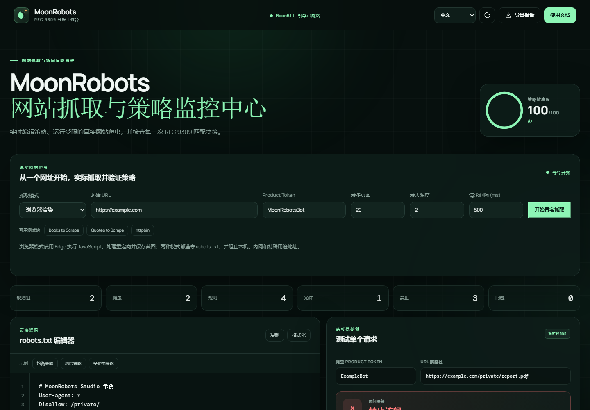

# MoonRobots

MoonRobots Studio 是一个以 MoonBit 为核心实现的
[RFC 9309](https://www.rfc-editor.org/rfc/rfc9309.html) `robots.txt`
可视化分析、真实受限抓取、路径匹配、诊断与决策解释工作台。它同时提供浏览器 Studio、
可复用核心库和命令行工具。纯分析核心保持确定性；原生抓取器负责网络访问，适合 SEO
审计、站点维护、爬虫、AI Agent 和 WebAssembly 应用。

## 功能

- 浏览器可视化编辑器、健康评分和实时访问决策
- 中文/English 双语界面，首次打开默认使用中文
- MoonBit 原生真实爬虫：下载 robots.txt、抓取 HTML、提取标题和同源链接
- Edge 真实浏览器模式：执行 JavaScript、处理同源重定向、读取最终 DOM 并保存截图
- 限制页面数、深度、请求间隔、响应体体积与超时，并拦截本机/内网地址
- 高亮命中源码行，并展示所有候选规则、specificity 和淘汰原因
- 深度静态分析：语法、正确性、冗余、可维护性和风险提示
- 批量 URL 模拟、爬虫访问矩阵和自动边界用例生成
- 基于样本的规则覆盖率、未使用规则和被遮蔽规则分析
- Blog、电商、文档站、私有站点等可配置策略生成器
- 源码保留型优化器，区分安全修复和需要人工复核的修复
- 两份策略的结构与访问行为语义差异比较
- JSON、CSV 和 Markdown 报告接口
- 解析 `User-agent`、`Allow`、`Disallow` 和 `Sitemap`
- 合并具有相同 product token 的多个规则组
- 无明确匹配组时使用 `User-agent: *`
- 路径区分大小写，支持 `*` 通配符和 `$` 结尾锚点
- 最长八位组匹配优先；等长时 `Allow` 优先
- 规范化 UTF-8 与百分号编码以进行比较
- 忽略错误行并保留其他可解析规则
- 返回稳定的诊断代码和源代码行号
- 输出命中规则及决策理由
- 提供 `check`、`lint`、`format`、`analyze`、`trace`、`fix-safe` 命令



## 启动可视化 Studio

在项目根目录执行：

```powershell
powershell -ExecutionPolicy Bypass -File scripts/serve.ps1
```

然后访问：

```text
http://127.0.0.1:8877/web/index.html
```

页面和抓取后端完全在本机运行，`robots.txt` 内容不会上传到第三方服务。编辑策略、爬虫 product token、
单个 URL 或批量 URL 后，界面会由 MoonBit 引擎实时重新分析。右上角可以在中文和
English 之间切换，语言选择会保存在浏览器本地；首次打开默认选择中文。“真实网站爬虫”
面板会通过仅监听 `127.0.0.1` 的本地服务调用 MoonBit Native 执行器。

## 真实抓取

Studio 中输入公开的 HTTP(S) URL 后即可开始。默认“浏览器渲染”模式需要本机 Microsoft Edge；
“快速 HTTP”模式不启动浏览器。浏览器模式会对每个 URL 先执行 MoonBit robots.txt 审核，
审核通过后才交给隔离的无头 Edge。抓取期间界面实时显示当前阶段、URL、已处理页面、
已知队列、耗时、动态 ETA 和逐页结果；完成后自动生成策略评分与改进建议。命令行也可
直接运行快速 HTTP 模式：

```powershell
moon run --target native cmd/crawler -- https://example.com MoonRobotsBot 20 2 500
moon run --target native cmd/crawler -- https://example.com MoonRobotsBot 20 2 500 --json
```

参数依次为起始 URL、Product Token、最大页面数、最大深度和请求间隔毫秒数。抓取器会先
请求同源 `/robots.txt`，对每个待抓 URL 运行 RFC 9309 决策，仅从成功的 HTML 响应中提取
同源链接。`robots.txt` 返回 4xx 时按 RFC 视为没有规则；5xx 或网络错误时采取保守拒绝。

## 环境

```powershell
cd /d D:\conda\environments\moonbit\projects\moonrobots
set PATH=D:\conda\environments\moonbit;D:\conda\environments\moonbit\moonbit-toolchain\bin;D:\conda\environments\moonbit\Library\bin;%PATH%
moon version
```

如果你在本机 Windows 上使用项目，推荐直接双击项目根目录中的 `start_moonrobots.bat`，它会自动检测环境、清理端口并在启动完成后打开浏览器页面：

```text
http://127.0.0.1:8877/web/index.html
```

## 快速使用

仓库包含一份可运行的 [示例策略](examples/robots.txt)。检查允许访问的 URL：

```powershell
moon run cmd/main -- check examples/robots.txt ExampleBot https://example.com/private/public/page
```

输出：

```text
ALLOWED: /private/public/page
User-agent: ExampleBot
Matched: Allow: /private/public/ (line 4)
```

检查被禁止的 URL：

```powershell
moon run cmd/main -- check examples/robots.txt ExampleBot https://example.com/private/secret
```

此时输出 `DISALLOWED`，并返回退出码 `1`。

检查文件问题：

```powershell
moon run cmd/main -- lint examples/robots.txt
```

生成规范化文本：

```powershell
moon run cmd/main -- format examples/robots.txt
```

执行深度审计或查看完整匹配过程：

```powershell
moon run cmd/main -- analyze examples/robots.txt
moon run cmd/main -- trace examples/robots.txt ExampleBot /private/report.pdf
```

预览仅包含不会改变访问决策的安全修复：

```powershell
moon run cmd/main -- fix-safe examples/robots.txt
```

## 库 API

最简单的调用只需要三个参数：策略文本、爬虫 product token 和 URL。

```mbt check
///|
test "README one-shot API" {
  let robots = "User-agent: *\nDisallow: /private\n"
  assert_false(is_allowed(robots, "ExampleBot", "/private/report"))
  assert_true(is_allowed(robots, "ExampleBot", "/public"))
}
```

需要诊断或决策解释时，分别调用 `parse` 和 `evaluate`：

```mbt check
///|
test "README explainable API" {
  let policy = parse("User-agent: *\nDisallow: /drafts\n")
  let decision = evaluate(policy, "ArchiveBot", "/drafts/post")
  assert_false(decision.allowed)
  assert_true(explain(decision).has_prefix("DISALLOWED"))
}
```

## CLI 退出码

| 退出码 | 含义 |
|---:|---|
| `0` | URL 允许访问，或者 lint/format 成功 |
| `1` | URL 被禁止，或者 lint 发现诊断 |
| `2` | 参数错误或文件读取失败 |

## 支持边界

真实抓取器有意保持清晰边界：

- 只抓取起始 URL 的同源页面，不跨站跟踪链接
- 快速 HTTP 模式不跟随重定向；浏览器模式处理同源重定向，但阻止跨源文档导航
- 当前不解析 Sitemap XML，也不处理登录、验证码或访问限制绕过
- 为防止 SSRF，拒绝 localhost、本机、私网、链路本地与其他特殊用途 IPv4 地址
- 当前仅解析 IPv4 DNS 结果；响应体上限在下载完成后判定
- 将 `robots.txt` 当成身份认证或安全控制
- 模拟各搜索引擎未标准化的私有扩展

`Sitemap` 会被收集，其他扩展字段会产生 `unknown-record` 警告，但不会终止规则组。

## 开发与测试

```powershell
moon fmt
moon check --deny-warn
moon test --deny-warn
moon test --target all --deny-warn
moon build --target all
moon package --list
```

测试覆盖解析错误、重复规则组、通配组回退、最长匹配、Allow 平局优先、通配符、
结尾锚点、URI 提取、查询字符串、UTF-8、百分号编码、匹配追踪、静态分析、批量模拟、
安全修复、语义差异、报告序列化和 CLI 退出码。浏览器构建另用无头 Edge 进行真实加载检查。

## 参赛要求与交付清单

本项目已按比赛要求尽量完成以下交付项：

- 以 MoonBit 为主实现语言，核心解析、决策和分析均在 MoonBit 中实现
- 公开代码仓库与可追踪 Git 提交记录
- 清晰的 README、示例、命令行和启动说明
- 可运行的 CLI 和 Studio 示例
- CI 工作流用于自动化校验
- 测试与构建命令可在本地和 CI 中重复执行
- 可打包为发布产物，适用于 mooncakes.io 交付前的最终发布流程

发布到 mooncakes.io 前，请确认：

1. 将 `moon.mod` 中的 `name` 与 `repository` 替换为你的真实 mooncakes.io / GitHub 信息。
2. 确认模块版本号和发布描述已与最终提交一致。
3. 运行 `moon package --list` 或 `moon package` 生成最终产物后再提交验收。

## 项目资料

- [项目申报书](PROPOSAL.md)
- [一页申请书草稿](APPLICATION.md)
- [设计说明](docs/DESIGN.md)
- [RFC 9309 符合性说明](docs/COMPLIANCE.md)
- [兼容性边界](docs/COMPATIBILITY.md)
- [测试策略](docs/TESTING.md)
- [第三方来源及许可证](NOTICE.md)
- [更新日志](CHANGELOG.md)

## License

Apache-2.0。详见 [LICENSE](LICENSE) 与 [NOTICE](NOTICE.md)。
